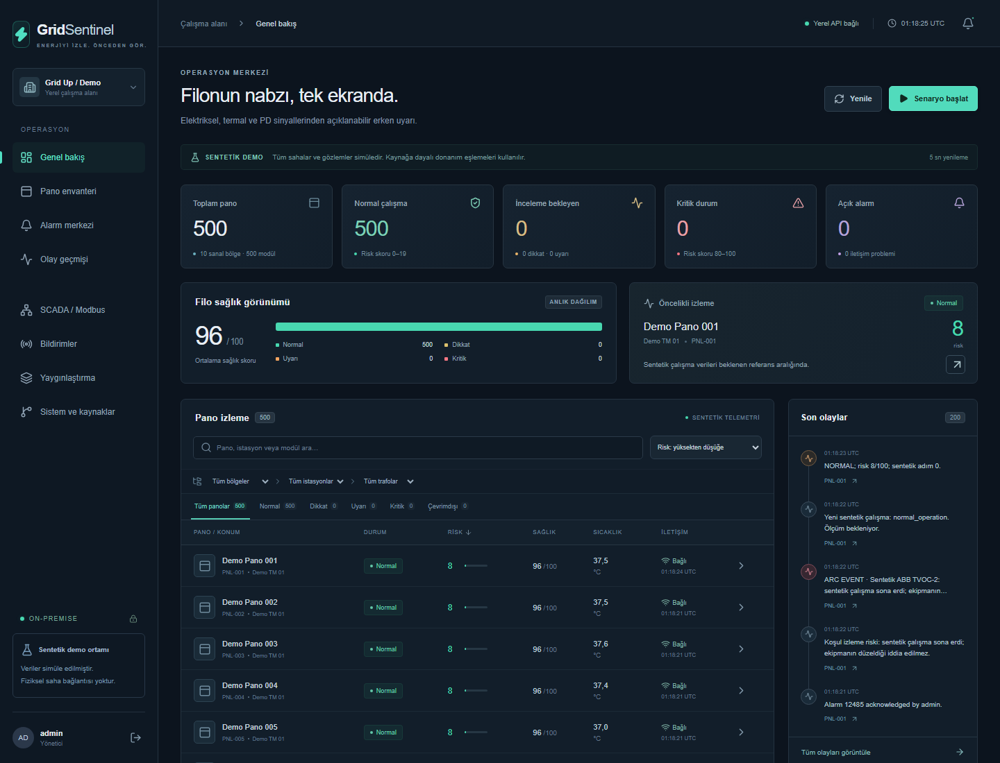
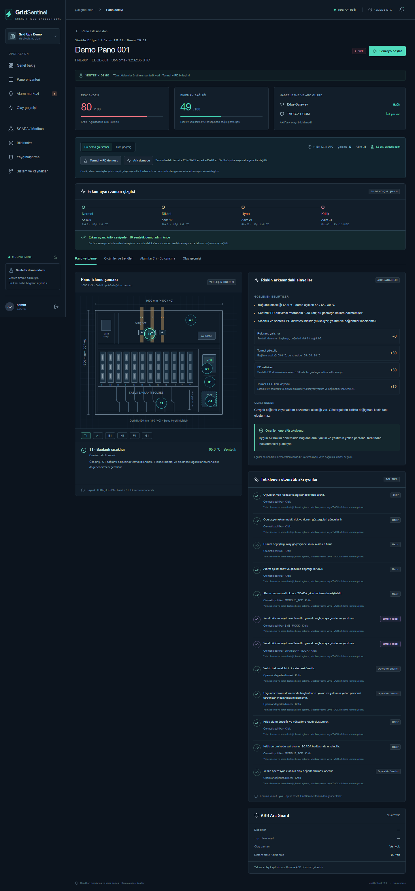
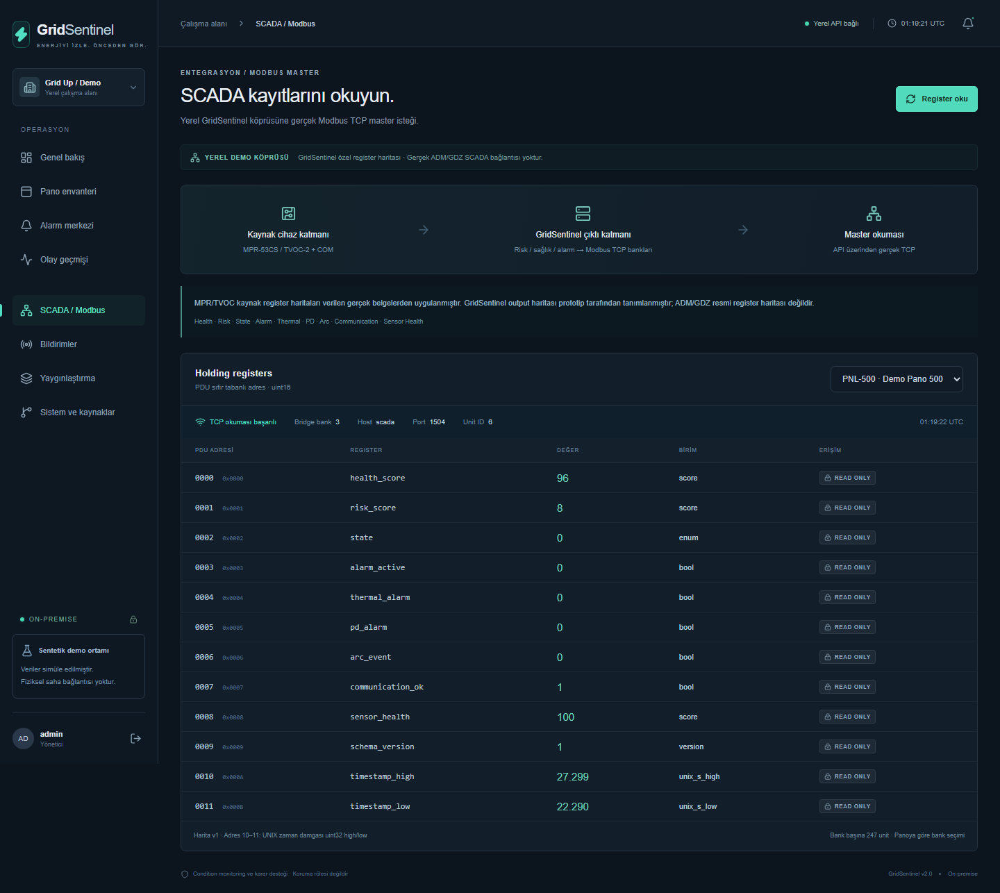
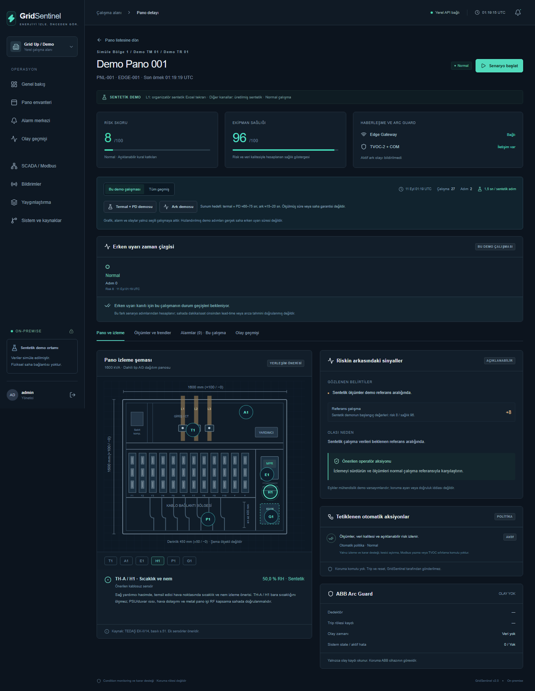

# GridSentinel

**Elektrik dağıtım panoları ve OG hücreleri için açıklanabilir erken uyarı ve condition-monitoring platformu.**

## Proje Özeti

GridSentinel; elektriksel yük, sıcaklık, nem, kısmi deşarj ve ark göstergelerini birlikte değerlendirerek normal çalışma davranışından sapmaları erken aşamada görünür kılmayı amaçlayan, şirket içinde çalışan bir izleme prototipidir.

Mevcut MPR-53CS ve ABB TVOC-2 gibi cihazlardan elde edilebilen verileri, önerilen retrofit sensörlerle aynı izleme katmanında birleştirir. Operatöre riskin nedenini, veri güvenilirliğini ve önerilen aksiyonu açıklar. Mevcut koruma ekipmanlarının yerine geçmez.

Grid Up Hackathon kapsamında geliştirilen prototipin çalışan demosu 500 sanal pano içerir. Donanım yerleşimi, kaynak 1600 kVA AG pano çizimine dayanır; OG hücrelere uyarlama saha değerlendirmesi gerektirir. **Demo gözlemleri sentetiktir.**



## Problem

Elektriksel yük, bağlantı sıcaklığı, nem ve izolasyon belirtileri ayrı ayrı izlendiğinde aynı ekipmandaki değişimlerin birlikte değerlendirilmesi zorlaşır. Koruma cihazları kendi güvenlik işlevlerini yürütürken, bakım ekiplerinin riskin gelişimini ve veri eksikliklerini açıklayan ortak bir izleme görünümüne ihtiyacı vardır.

## Çözüm

GridSentinel, mevcut cihaz yatırımını kullanan bir izleme katmanı sunar. Farklı sinyalleri aynı pano ve zaman bağlamında değerlendirir; açıklanabilir risk puanı, kalıcı alarm ve operatör önerisi oluşturur. CORE, THERMAL ve ADVANCED PD kapsamları, ek sensör yatırımının saha ihtiyacına göre kademelendirilmesini destekler.

## Nasıl Çalışır?

1. Sentetik cihazlar ve kaynak akım replay'i, kimlik doğrulamalı MQTT üzerinden telemetri gönderir.
2. Merkez yazılımı kimlik, zaman sırası ve veri kalitesini kontrol ederek ölçümleri kalıcı olarak saklar.
3. Kurallar ve zaman içindeki değişimler risk durumunu, açıklamayı ve alarm aksiyonlarını belirler.
4. Operasyon ekranı ve salt okunur SCADA arayüzü güncel durumu gösterir; geçmiş kayıtlar korunur.

## Temel Özellikler

- Filo, pano şeması, ölçüm trendleri, alarm merkezi ve veri kalitesi görünümü.
- NORMAL → ATTENTION → WARNING → CRITICAL durumları ve kalıcı erken uyarı zaman çizelgesi.
- Güncel demo koşusu ile tüm geçmişin ayrı görüntülenmesi; tekrar mesajlarının tekilleştirilmesi.
- Kaynağa dayalı MPR/TVOC register decoder'ları ve 500 panoya erişen üç Modbus TCP bankı.
- On sentetik senaryo, rol tabanlı erişim, audit kaydı ve açıkça simüle bildirimler.
- Referans donanım/firmware dosyaları, A/B/C saha müdahale sınıfları ve parametrik maliyet hesabı.

## Sistem Mimarisi

**Sentetik cihazlar → Mosquitto MQTT → FastAPI / risk analizi → PostgreSQL → Next.js ve Modbus TCP**

Docker Compose; veritabanı, broker, API, web arayüzü, simulator ve SCADA bridge olmak üzere altı servis çalıştırır. Çalışma zamanında public cloud bağımlılığı yoktur. Önerilen fiziksel saha zinciri ile çalışan sentetik demo [sistem mimarisinde](docs/architecture.md) ayrı gösterilir.

## Erken Uyarı Yaklaşımı

Risk puanı; yük-sıcaklık ilişkisi, termal değişim, PD göstergeleri ve veri kalitesi gibi açıklanabilir katkılardan oluşur. Skor, fiziksel arıza olasılığı veya koruma ayarı değildir. Her durum geçişi gözlem, olası neden ve önerilen aksiyonla ilişkilidir.

ATTENTION seviyesinde kalıcı alarm, olay kaydı, SCADA işareti ve operatör önerisi bulunur; SMS/WhatsApp bildirimi oluşmaz. WARNING seviyesinde iki mock kanal devreye girer. CRITICAL yüksek öncelikli eskalasyon ekler; ark olayı acil simüle bildirim ve audit kaydı üretir. [Risk modeli](docs/anomaly-engine/risk-model.md) · [Aksiyon matrisi](docs/operations/action-matrix.md)

<details>
<summary>Erken uyarı zaman çizelgesi ve risk açıklaması</summary>



</details>

## SCADA ve Modbus Entegrasyonu

MPR-53CS ve TVOC-2-COM kaynak haritaları, GridSentinel'ın prototipe ait çıkış haritasından ayrıdır. Yerel SCADA master, ayrı bridge üzerinden gerçek TCP okuması yapar; cihaz yazma, trip veya reset komutu üretmez.

| Pano aralığı | TCP portu | Unit ID |
|---|---:|---|
| PNL-001–247 | 1502 | 1–247 |
| PNL-248–494 | 1503 | 1–247 |
| PNL-495–500 | 1504 | 1–6 |

PNL-500, **bank 3 / unit 6** üzerinden doğrulanmıştır. Portlar konteyner içi adreslerdir; isteğe bağlı host eşlemeleri [kurulum belgesinde](docs/deployment.md#windows-host-port-eşlemesi), register ayrıntıları [SCADA haritasında](docs/scada/register-map.md) yer alır.



## Saha Uygulama Yaklaşımı

Saha yaklaşımı mevcut analizör ve uygun Arc Guard arayüzünü kullanır; gerekli noktalara ek sıcaklık/nem sensörleri ve PD acquisition katmanı önerir. Montaj kapsamı A/B/C erişim ve kesinti sınıflarıyla değerlendirilir. Metal pano içinde RF, elektriksel izolasyon ve bakım erişimi ayrıca doğrulanmalıdır.

Referans kart, bağlantı/netlist/güç dosyaları ve host üzerinde test edilen C++ çekirdeği teknik yaklaşımı somutlaştırır. Bunlar üretilmiş kart veya tamamlanmış saha kurulumu değildir. [Kurulum sınıfları](docs/installation-matrix.md) · [Kablosuz tasarım](docs/wireless-design.md) · [Donanım referansı](hardware/pcb/README.md)

<details>
<summary>Kaynak pano geometrisi ve izleme noktaları</summary>



</details>

## Doğrulama Sonuçları

Son doğrulama kayıtları 11 Eylül 2026 tarihli yerel Docker ortamına aittir. Python kaynak hash testi, orijinal dokümanların bulunduğu ayrı doğrulama alanında çalışmıştır.

| Doğrulama | Sonuç |
|---|---|
| Python | 107 PASS + izole kaynak hash testi 1 PASS |
| Frontend birim testleri | 5/5 PASS |
| Üretim build / TypeScript | PASS |
| Stack smoke | PASS — 6 servis |
| PNL-500 TCP | PASS — API ve doğrudan host okuması |
| 100 / 250 / 500 pano yük testi | 6/6 PASS — HTTP ve MQTT |
| Kalıcı veritabanı commit'i | 6.800 / 6.800 |
| 500 panolu normal demo | 500 NORMAL / 0 offline / 0 güncel açık alarm |

[Son doğrulama özeti](docs/verification/final-verification.json), [kabul kapsamı](docs/acceptance.md) ve [performans raporu](docs/performance.md) ölçüm ortamını ve sınırlarını içerir. Yük sonuçları kısa sentetik burst ölçümleridir; sürekli üretim kapasitesi garantisi değildir.

## Yerel Demo

Docker Linux engine, Compose v2 ve Python 3.10+ bulunan ortamda 500 sanal pano için başlangıç komutu:

```bash
python scripts/run_demo.py --presentation --panels 500 --scenario normal_operation
```

Bu modda PNL-001 odak demo panelidir; diğer 499 pano veri gönderimini sürdürür. Termal+PD ve Ark senaryoları arayüz üzerinden tetiklenebilir. Kullanıcı bilgileri ilk başlatmada yerel `.env` dosyasında oluşturulur.

[Yerel arayüz](http://localhost:3000) · [Kurulum rehberi](docs/install-guide.md) · [Demo akışı](docs/demo-walkthrough.md)

### Doğrulanmış Demo Sonuçları

| Senaryo / ölçüt | Ölçülen sonuç |
|---|---:|
| Combined Thermal + PD | 48,096 s |
| Arc Event | 13,050 s |
| Erken uyarı | Kritik seviyeden 10 sentetik adım önce |

Kaynak: [uçtan uca runtime ölçümü](docs/verification/v2-runtime.json). Bu süreler hızlandırılmış sentetik demo zamanıdır; gerçek saha arıza tahmin süresi olarak yorumlanmamalıdır.

## Repository Yapısı

| Bölüm | Açıklama |
|---|---|
| [Sistem mimarisi](docs/architecture.md) | Çalışan demo ve önerilen saha zinciri |
| [Yerel kurulum](docs/install-guide.md) | Gereksinimler, servisler ve yapılandırma |
| [Demo akışı](docs/demo-walkthrough.md) | Senaryolar ve gözlenebilir davranış |
| [Gereksinim izlenebilirliği](docs/requirements-traceability.md) | Kaynak, uygulama, doğrulama ve sınır |
| [Değerlendirme kapsamı](docs/evaluation-coverage.md) | Teknik değerlendirme kriterlerinin karşılığı |
| [Performans](docs/performance.md) | Ölçek ölçümleri ve test yöntemi |
| [Saha müdahale sınıfları](docs/installation-matrix.md) | A/B/C erişim ve kesinti koşulları |
| [Maliyet/fayda](docs/cost-benefit.md) | Kademeli yatırım ve parametrik TCO |
| [Yenilikçi yaklaşım](docs/innovation.md) | Tasarım tercihleri ve somut karşılıkları |
| [Donanım](hardware/) | Kart, bağlantı ve yerleşim referansları |
| [Edge firmware](edge/firmware/) | C++ çekirdeği ve doğrulama kapsamı |
| [Kaynak analizi](docs/source-analysis.md) | Organizatör dokümanlarından çıkarımlar ve hash kayıtları |

## Teknik Sınırlar

- Tüm demo gözlemleri sentetiktir; gerçek ADM/GDZ SCADA bağlantısı yapılmamıştır.
- SMS/WhatsApp gönderimleri simüledir. PD verileri kalibre saha ölçümü değildir.
- PCB fiziksel olarak üretilmemiştir; ERC/DRC ve ESP32 hedef build/flash doğrulaması yapılmamıştır. Host C++ testleri fiziksel sürücü doğrulaması değildir.
- RF kapsama, pil ömrü, EMC, saha eşikleri ve gerçekleşmiş maliyet/fayda pilot çalışma gerektirir.
- Prototip tek API süreciyle ölçülmüştür; uzun süreli yük ve çoklu worker işletimi ayrıca doğrulanmalıdır.
- GridSentinel koruma rölesi değildir; kesici kontrol etmez. ABB koruma işlevi bağımsızdır.
