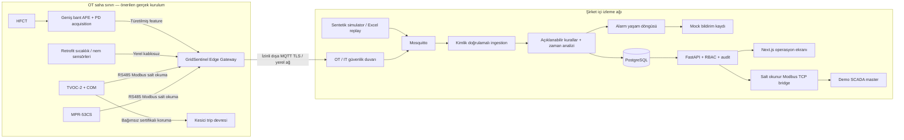

# GridSentinel mimarisi

GridSentinel, AG pano/OG hücre condition monitoring ve erken uyarı prototipidir. Mevcut cihazları değiştirmeden verilerini toplar. Sertifikalı koruma cihazı kendi trip devresini sürdürür; GridSentinel'ın bu devreye kontrol yolu yoktur.

## Çalışan demo ile saha tasarımı
Compose'da fiziksel OT bileşenleri yoktur. MQTT'ye gerçek ağ paketleri gönderen sentetik simulator, çalışan backend ve PostgreSQL, Next.js, gerçek yerel Modbus TCP bridge vardır. MPR/TVOC register decoder'ları kaynak PDF'lerden uygulanmıştır; gerçek cihazlarla denenmemiştir. HFCT acquisition yalnızca kavramsal zincirdir; demo feature'ları sentetiktir. SMS/WhatsApp kayıtları `simulated` durumundadır ve sağlayıcıya gönderilmez.

## Akış ve veri güvenilirliği
Telemetry mesajı UUID/cihaz/pano/timestamp, ölçümler, kalite, köken ve Arc Guard durumunu taşır. Akımın workbook kaynağı ile üretilen diğer kanallar ayrılır. Backend cihaz kimliğini kontrol eder, duplicate ve zaman sırası ihlalini ele alır, risk/açıklama/alarm/bildirim kayıtlarını saklar. API fleet aggregation ve pano history sunar. SCADA ayrı process olarak fleet snapshot'ını okur, kendi uint16 PDU haritasını TCP üzerinden sunar. Tarayıcı master ekranı API aracılığıyla gerçekten TCP okur.

## Tercihler ve ölçek
Tek FastAPI süreçli prototip operasyonel sadelik sağlar. PostgreSQL `(panel_id,timestamp)` ve mesaj kimliği indeksleriyle time-series saklar; TimescaleDB zorunlu tutulmadı çünkü ilk hedef 100–500 sanal modülün ölçülmüş davranışıdır. Redis ve ML modeli eklenmedi: deterministic risk+trend bu demo için açıklanabilir sonuç sağlar. Üretimde retention/partitioning, bağımsız ingestion workers, merkezi rate limit/session store ve telemetry kuyruğu değerlendirilmelidir. Ölçülen sınırlar `performance.md` içinde.

V2'de Modbus unit ID sınırı üç banka ile korunur: 1502 portu ilk247 panoyu, 1503 sonraki247 panoyu, 1504 son6 panoyu sunar. PNL-500, banka3/unit6 olarak gerçek yerel TCP üzerinden adreslenir. Tek authenticated fleet poll üç snapshot'a dağıtılır; API ve bridge aynı adresleme modülünü kullanır. [Banka yapılandırması](scada/register-map.md) içinde sınırlar ve port ayarları bulunur.

## Bağlantı kesintileri
`edge/firmware` V2 referans C++ çekirdeği, salt okunur RTU paketleme/decoder, sınırlı kalıcı kuyruk, stable message id ve PUBACK replay host testlerini içerir. ESP32-S3 hedef giriş noktası fiziksel portlar devreye alınmadan fail-closed kalır; native embedded build/flash saha doğrulaması değildir. [Firmware durumları](hardware/firmware.md), [PCB artefact'ları](../hardware/pcb/). Mevcut Python readonly poller/TCP-to-RTU arayüzü korunur. MQTT subscriber kalıcı broker oturumu ve transaction sonrası manual ACK kullanır; DB hatasında bounded kuyruk tekrar dener. Uzun outage/disk dolması/broker disk kaybı için sıfır kayıp garantisi yoktur.
