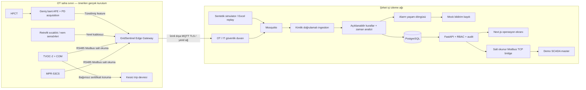

# GridSentinel mimarisi

GridSentinel, AG pano/OG hücre condition monitoring ve erken uyarı prototipidir. Mevcut cihazları değiştirmeden verilerini toplar. Sertifikalı koruma cihazı kendi trip devresini sürdürür; GridSentinel'ın bu devreye kontrol yolu yoktur.

## Çalışan demo ile saha tasarımı
Compose'da fiziksel OT bileşenleri yoktur. MQTT'ye gerçek ağ paketleri gönderen sentetik simulator, çalışan backend ve PostgreSQL, Next.js, gerçek yerel Modbus TCP bridge vardır. MPR/TVOC register decoder'ları kaynak PDF'lerden uygulanmıştır; gerçek cihazlarla denenmemiştir. HFCT acquisition yalnızca kavramsal zincirdir; demo feature'ları sentetiktir. SMS/WhatsApp kayıtları `simulated` durumundadır ve sağlayıcıya gönderilmez.

## Akış ve veri güvenilirliği
Telemetry mesajı UUID/cihaz/pano/timestamp, ölçümler, kalite, köken ve Arc Guard durumunu taşır. Akımın workbook kaynağı ile üretilen diğer kanallar ayrılır. Backend cihaz kimliğini kontrol eder, duplicate ve zaman sırası ihlalini ele alır, risk/açıklama/alarm/bildirim kayıtlarını saklar. API fleet aggregation ve pano history sunar. SCADA ayrı process olarak fleet snapshot'ını okur, kendi uint16 PDU haritasını TCP üzerinden sunar. Tarayıcı master ekranı API aracılığıyla gerçekten TCP okur.

## Tercihler ve ölçek
Tek FastAPI süreçli prototip operasyonel sadelik sağlar. PostgreSQL `(panel_id,timestamp)` ve mesaj kimliği indeksleriyle time-series saklar; TimescaleDB zorunlu tutulmadı çünkü ilk hedef 100–500 sanal modülün ölçülmüş davranışıdır. Redis ve ML modeli eklenmedi: deterministic risk+trend bu demo için açıklanabilir sonuç sağlar. Üretimde retention/partitioning, bağımsız ingestion workers, merkezi rate limit/session store ve telemetry kuyruğu değerlendirilmelidir. Ölçülen sınırlar `performance.md` içinde.

Modbus unit ID aralığı247 cihazdır. 250/500 pano merkezi ingestion testinde desteklenir; SCADA tarafında birden çok bridge veya ayrık register bank tasarımı gerekir. Bu prototip aynı anda ilk247 panoyu tek bridge'de sunar.

## Bağlantı kesintileri
`edge/` saha gateway entegrasyon sınırını ve firmware yaklaşımını belgeler; çalışan fiziksel edge firmware veya kalıcı edge spool teslimi değildir. Salt okunur cihaz poller/TCP-to-RTU arayüzü uygulanmıştır. MQTT QoS1 duplicate olasılığı backend mesaj kimliğiyle yönetilir. Subscriber kalıcı broker oturumu ve transaction sonrası manual ACK kullanır; DB hatasında bounded kuyruktaki frame yeniden denenir. Backend/DB/MQTT yeniden başlatma davranışı testlerle ölçülür. Uzun süreli outage, dolan disk/kuyruk ve broker disk kaybı için üretim seviyesi sıfır kayıp garantisi yoktur.
