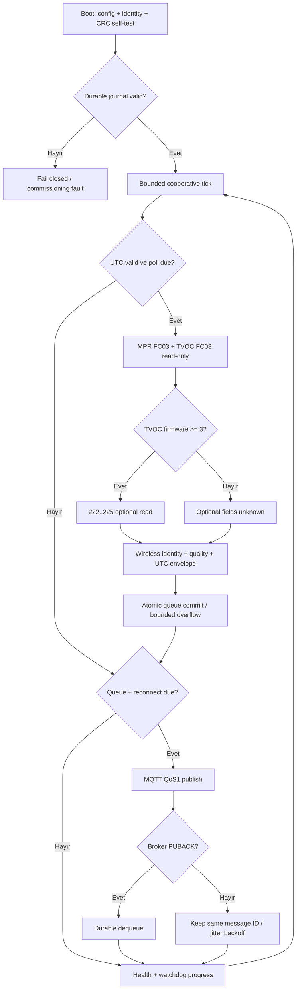

# Referans MCU yazılımı ve doğrulama sınırı

`edge/firmware` altında ESP32-S3 + harici SPI Ethernet için C++17 kaynak kodu vardır. Yerel Linux host compiler container'ında çekirdek **7 grup / 308 kontrol PASS**; komut/compiler/hash/tarih `edge/firmware/test/verification.json` içindedir. ESP-IDF/PlatformIO/Arduino toolchain kurulu olmadığı için **ESP32 hedef derlemesi NOT_RUN**. Fiziksel kart ve saha kurulumu yoktur. Bütün host gözlemleri generated synthetic'tir.

| Modül | Somut uygulama | Doğrulama / kalan port |
|---|---|---|
| Boot/self-test | Config/device identity ve adapter provenance eşitliği, sabit CRC vektörü, journal restore | Physical adapter'ı synthetic etiketleme boot'ta reddedilir; invalid config/identity ve corrupt snapshot host testi; MCU brownout başlangıcı bekliyor |
| Identity/config | Max31 karakter alfanümerik/`-`/`_`; port/unit/timeout sınırı, MQTT için explicit provisioning + local endpoint bayrakları | Fleet credential içeriği gömülmez; gerçek key/cert provisioning portu yok |
| Watchdog | Her tamamlanan bounded tick sonunda `Watchdog.feed`; health counters ayrı | Host feed kontrolü var; ESP-IDF task watchdog ve harici supervisor sürücüsü bekliyor |
| RTU polling | `ReadOnlyRtu` yalnız FC03/04; unit1..247, count1..125, CRC, byte-count, function, unit ve timeout kontrolü | Fake bounded serial exchange test edildi; physical UART drain/DE/t3.5 ve çok-master koordinasyonu bekliyor |
| MPR map | Generated `kMprRegisters`: address,width,scale,signed,page; configurable word order | Python harita eşitliği otomatik; mevcut kaynağın belirtmediği word order **Big unverified default** |
| TVOC map | FC03, firmware800/801; state1300..1306; latest trip100..105; diagnostics200..212; modules500; firmware≥3 ise222..225 | Firmware gate, sentinel, bit masks, timestamp test edildi.213/1000/1100 hiçbir poll'da yok |
| Wireless/quality | `WirelessReceiver.latest`; validated identity + `TH-A / H1`, monotonic age, missing/invalid/stale → JSON null | BLE pairing/MAC replay/auth/RSSI driver'ı bekliyor; varsayımsal humidity0..100/temp−50..150 sanity bounds ekipman çalışma sınırı değildir |
| UTC | Explicit sync, monotonik süre,15dakika varsayılan holdover, geri giden/invalid sync reddi | UTC yokken observation oluşturulmaz; dış zaman kaynağı/NTP/RTC driver'ı yok |
| MQTT | Topic identity, QoS1 publish result; broker PUBACK'ten sonra durable dequeue | Fake publisher ile disconnect/retry/PUBACK test; ESP-MQTT TLS/cert/socket driver'ı yok |
| Offline/store-forward | 8 frame sabit kapasite, snapshot CRC, stable device-sequence ID; en yeni overflow reddi/drop sayacı | POSIX fsync+rename journal ve ayrı process reload test edildi; embedded NVS/FRAM atomicity/endurance bekliyor |
| Backoff/health | Identity-seeded jitter,500ms başlangıç,30s cap, bounded counters; MPR/TVOC bağımsız online | Başarısız bağlantıda busy loop yok; false communication hiçbir ölçümü sıfır/healthy yapmaz |

MPR PDU0-based multiword values use source widths and signed scaling: phase power signed32 and energy4words. `decode_raw_u64` retains the exact64-bit pattern. The floating `Value` decoder rejects integer magnitudes above2^53 instead of silently rounding energy counters; exporting full counters requires the exact decoder and a decimal-string/uint64 normalizer. Register84 digital output is raw; bit meaning remains unspecified. CT/VT scale is not multiplied a second time. Full metadata is available even where the minimal runtime samples only selected fast measurements.

ABB source RevD s.22–28 gives trip words, HHMM byte packing, days since1970, six-word sentinel and status extension limits. `decode_trip` applies only an **explicit** device UTC offset; default0 is unverified, not evidence the TVOC is set to UTC. The all-FFFF event is missing; partial sentinel or impossible time invalid. Low/high detector masks and K4/K5/K6 relay bits remain raw metadata. Zero sensor status is not blindly decoded as ten detector failures: active-error context, installed module bits and applicable firmware must be assessed in the final normalizer. Unknown reads serialize null; optional words not read are not zero measurements.

Store-forward semantics are **at least once to the broker**: a crash after PUBACK before durable dequeue can replay the same ID. Backend/application acknowledgement is a different guarantee and is not claimed. A failed or uncertain journal commit stops new allocation/publishing until reboot reload; identity mismatch/corruption does not silently reset sequence1. Losing/erasing the whole NVM requires a new provisioned device identity/epoch before reuse. Queue overflow preserves the oldest8frames, increments dropped, and rejects the newest observation; this is a finite demonstration buffer, not a long outage retention claim. Time absence prevents new frames, but existing correctly timestamped frames may still replay. Snapshot copies use roughly80KiB RAM; instantiate queue as static storage on the MCU, size task stacks and measure heap usage before porting.

The reference payload uses `edge_schema_version:1`, scenario `reference_edge`, missing/stale quality and raw source metadata. **It is an edge-side reference envelope, not a currently accepted live-data path into the synthetic demo API.** `device_read_unverified` must not be relabeled synthetic to bypass validation. An explicitly reviewed live ingestion normalizer/schema, provisioned identity/certificates and field validation are required before connection. Current ESP-IDF entry starts no network/UART driver and emits no MQTT traffic. The host tests do not connect to Mosquitto or alter application data.

Source-derived MPR/TVOC maps are generated using `python edge/firmware/tools/generate_register_maps.py`; `--check` and `tests/hardware/firmware/test_reference.py` detect drift against reviewed Python drivers. Field integration also needs a verified UART timing port, WIZ850io initialization, authenticated local MQTT/TLS, radio pairing/receiver, UTC sync, NVM transactional port and watchdog binding. Exact build/test commands are in [firmware README](../../edge/firmware/README.md). No Modbus write/reset/protection control API or breaker output exists.
