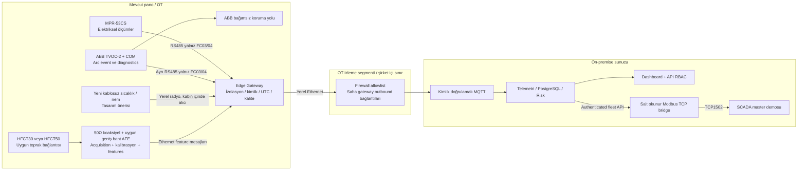

# Saha donanım ve veri akışı konsepti

Bu çizimler **hackathon mühendislik konseptidir**. PCB üretimi, EMC/izolasyon/ürün sertifikasyonu veya fiziksel pano kurulumu yapılmadı. Kaynağa dayanan ekipman özellikleri ile yeni öneriler ayrıdır. GridSentinel condition monitoring sağlar; Arc Guard ve diğer koruma cihazları kendi görevlerini sürdürür.

Koruma yolu gateway, MQTT, DB veya sunucu kullanılabilirliğine bağlı değildir. Optik detektörler ABB'nin kendi sertifikalı sisteminin parçasıdır; gateway bunları genel amaçlı ADC'ye bağlamaz. Yeni sıcaklık/nem radyo düğümleri yalnız condition-monitoring verisi taşır. Demo sırasında tüm saha bloklarının gözlemleri sentetik generator'dan gelir; yalnız merkez yazılımı ve TCP master gerçek proses/socket olarak çalışır.

Önerilen gateway kategorisi endüstriyel Linux cihazı veya endüstriyel carrier üzerinde MCU+Ethernet sistemidir. Seçim; 2 bağımsız galvanik izole RS485 portu, Ethernet, uygun çalışma sıcaklığı, watchdog, kalıcı kayıt alanı, güvenli anahtar depolama ve yerel radio receiver gereksinimlerine göre yapılır. İki port cihazların baud/parity'lerini ve arıza alanlarını ayırır; var olan RTU bus'a ikinci master doğrudan eklenmez. Uygun arbiter veya onaylı mevcut master üzerinden veri alınır.

Gateway güç/terminal konsepti [arayüz şemasında](../../hardware/schematic/interfaces.md), sensör ve pano yerleşimi [yerleşim belgesinde](panel-placement.md), malzeme listesi [BOM belgesinde](bom.md), kesinti sınıfları [matriste](../installation-matrix.md). Hiçbiri canlı kurulum talimatı veya tamamlanmış üretim tasarımı değildir.
