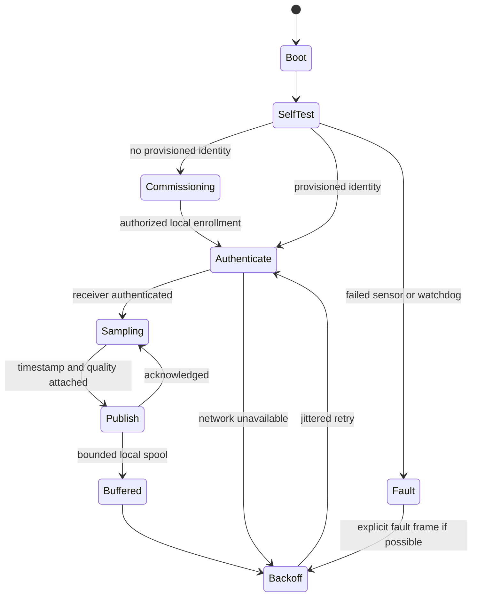

# Sensor firmware / gateway lifecycle concept

This is an unimplemented firmware design, not a flashed or tested embedded product.

Required state: unique per-device identity, secure credentials, monotonic sequence/counter, UTC synchronization status, sampling interval, calibration revision, battery estimate, channel diagnostic state and last accepted acknowledgement. Newly generated message IDs stay unchanged during replay/retry. A boot without trusted time reports invalid time and buffers or quarantines; it does not fabricate a contemporary observation date.

Future gateway spool is disk-backed and bounded by both age and bytes. A proposed 24h retention is a planning choice, not implemented endurance evidence. Overflow produces a visible dropped-data counter and interval. Backoff with jitter prevents synchronized500-panel reconnect; old observations remain marked historical and cannot overwrite latest state. Keys are unique, rotated through authorized local enrollment; no fleet-wide factory secret in repository.

No MCU trip/reset algorithm, breaker driver or certified protection replacement is included. Wireless sensors transmit low-bandwidth environmental observations; dedicated acquisition processes HFCT waveforms separately.
