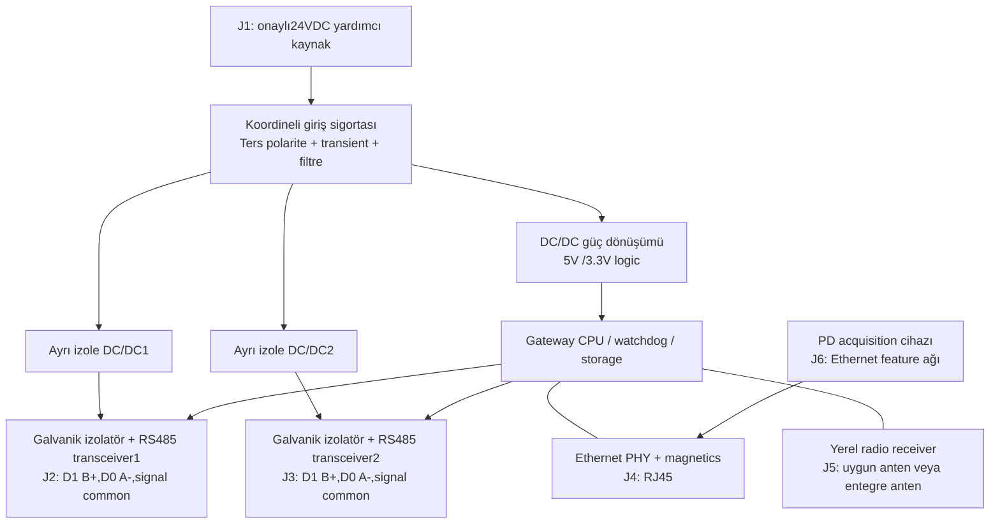

# Gateway I/O, güç ve konektör konsepti

**Elektronik blok şemasıdır; PCB netlist, kablo montaj talimatı veya doğrulanmış izolasyon tasarımı değildir.** Komponent değerleri/koruma koordinasyonu, EMC, transient, creepage/clearance ve termal testler üretim öncesi uzman tarafından tasarlanmalıdır. Şebeke/baraya yeni canlı bağlantı yapılmaz.

| Konektör | Önerilen işlev | Tasarım sınırı |
|---|---|---|
| J1.1 /J1.2 | +24VDC /0V | Gerilim değerinin saha beslemesine uyumu, sigorta ve güç bütçesi doğrulanacak |
| J2.1/.2/.3 | MPR portD1/B+,D0/A−,signal common | Üretici terminal adlandırması devreye almada kontrol edilir; RS485 A/B isimleri üreticiler arasında körlemesine eşitlenmez |
| J3.1/.2/.3 | TVOC-COM port+(B),−(A),DGND | ABB manual s.12 terminal eşlemesi; signal common protective earth değildir |
| J4 | Yerel Ethernet RJ45 | Magnetics ve surge/EMC uygunluğu; yalnız on-premise OT monitoring VLAN |
| J5 | Radio antenna/receiver | Metal kabin RF deneyi; anten geçişi yeni IP açıklığı oluşturmaz |
| J6 | Acquisition feature arayüzü | BNC hamPD gateway logic pinine bağlanmaz; ayrı acquisition Ethernet üzerinden feature iletir |

ABB kaynak s.12–13: RS485 iki telli daisy-chain; hat başı/sonunda120Ω terminasyon, star topolojisi önerilmez. Bias tek koordine noktadan sağlanır; mevcut master/gateway bias'ı varsa tekrar eklenmez. Sinyal ground, ekran bonding ve izolasyon iki cihazın kılavuzu/OT topraklama projesiyle birlikte değerlendirilir. Ekran ile protectiveearth körlemesine kısa devre edilmez. Çok master aynı RTU bus'a doğrudan bağlanmaz. Seri bus ayarı mevcut koruma haberleşmesini bozacak şekilde değiştirilmez.

İki port galvanik ayrımı arıza yayılımını azaltma hedefidir; sağlandığına dair ölçüm yoktur. MPR ve TVOC polling sadeceFC03/04. Kontrol rölesi, trip/reset çıkışı, dijital çıkış sürücüsü veya breaker GPIO konektörü **tasarıma dahil değildir**.

Örnek **hesap varsayımı**: gateway6W + radio1W + iki izoleport toplam1W =8W;24V'da ideal0.33A. %80 dönüşüm varsayımıyla giriş10W/0.42A; %50 kapasite payı hedefi15W. Bunlar ölçülmüş tüketim veya seçilmiş PSU özellikleri değildir. PD acquisition güç bütçesi ayrıca kendi üreticisinden alınır; pil ömrü radyo protokolü/sıklığı/sıcaklık/uyku tüketimi ölçülmeden verilmez. Kaynak yoksa yeni PSU montajı ve upstream koruma düzenlemesi sınıfC planlı kesinti işidir.
